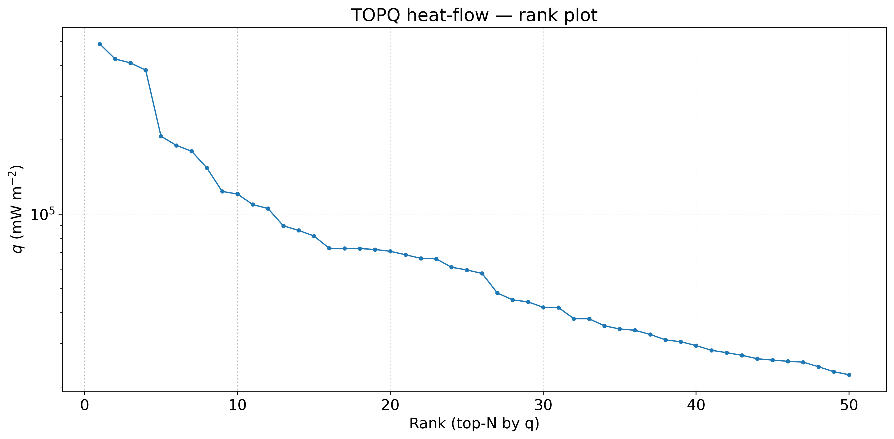

# Appendix — TOPQ & ULTRA

## TOPQ (measurement-level)
- Rows (top-N by q): **50**
- Rows with dist_min_km ≥ DIST_CUTOFF_KM km: **28** (56.0 %)
- Unique ~1 km sites within TOPQ: **15**
- Sites with dist_min_km ≥ DIST_CUTOFF_KM km: **3** (20.0 %)

