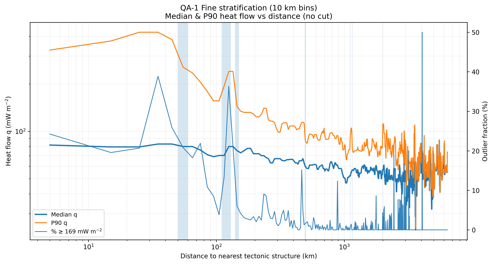

# QA-1 — Fine heat-flow stratification (10 km bins)

- Threshold reference: Q_THR_RELEV = 169.0 mW m$^{-2}$
- Bin width: 10 km
- Gradient threshold: 0.20
- Smoothing window (median): 3

## First 40 bins

| dist_bin       |     N |   q_median |    q_p90 |      q_max |   pct_ge_thr |   bin_center_km |   q_med_smooth |   q_p90_smooth |   d_pct_median |   d_pct_p90 | crit_any   |
|:---------------|------:|-----------:|---------:|-----------:|-------------:|----------------:|---------------:|---------------:|---------------:|------------:|:-----------|
| [0.0, 10.0)    | 10463 |     84.000 |  374.680 | 123701.000 |       24.228 |           5.000 |         81.775 |        328.060 |          0.000 |       0.000 | False      |
| [10.0, 20.0)   |  5617 |     79.549 |  281.440 |   6487.500 |       19.566 |          15.000 |         79.549 |        374.680 |         -0.027 |       0.142 | False      |
| [20.0, 30.0)   |  4362 |     77.000 |  425.800 |  12226.000 |       20.679 |          25.000 |         79.549 |        425.800 |          0.000 |       0.136 | False      |
| [30.0, 40.0)   |  4061 |    108.000 | 1488.000 |  33920.000 |       38.857 |          35.000 |         83.000 |        425.800 |          0.043 |       0.000 | False      |
| [40.0, 50.0)   |  2623 |     83.000 |  382.000 |   8570.000 |       25.848 |          45.000 |         83.000 |        382.000 |          0.000 |      -0.103 | False      |
| [50.0, 60.0)   |  2087 |     80.000 |  255.000 |   2637.200 |       20.795 |          55.000 |         80.000 |        255.000 |         -0.036 |      -0.332 | True       |
| [60.0, 70.0)   |  1896 |     76.000 |  205.100 |   3140.000 |       18.249 |          65.000 |         80.000 |        235.000 |          0.000 |      -0.078 | False      |
| [70.0, 80.0)   |  2051 |     80.000 |  235.000 |   2984.800 |       21.892 |          75.000 |         76.000 |        205.100 |         -0.050 |      -0.127 | False      |
| [80.0, 90.0)   |  1801 |     69.000 |  179.000 |  89800.000 |       10.827 |          85.000 |         71.000 |        179.000 |         -0.066 |      -0.127 | False      |
| [90.0, 100.0)  |  1396 |     71.000 |  156.000 |   6176.500 |        8.524 |          95.000 |         69.000 |        156.000 |         -0.028 |      -0.128 | False      |
| [100.0, 110.0) |  1282 |     64.000 |  135.910 |    615.000 |        3.822 |         105.000 |         70.200 |        156.000 |          0.017 |       0.000 | False      |
| [110.0, 120.0) |  1305 |     70.200 |  193.622 |   3400.000 |       13.410 |         115.000 |         70.200 |        193.622 |          0.000 |       0.241 | True       |
| [120.0, 130.0) |  1641 |    100.000 |  550.000 | 489000.000 |       36.319 |         125.000 |         80.000 |        240.000 |          0.140 |       0.240 | True       |
| [130.0, 140.0) |  1326 |     80.000 |  240.000 |   1169.000 |       20.890 |         135.000 |         80.000 |        240.000 |          0.000 |       0.000 | False      |
| [140.0, 150.0) |  1149 |     72.000 |  144.200 |   1162.000 |        6.005 |         145.000 |         75.400 |        144.200 |         -0.057 |      -0.399 | True       |
| [150.0, 160.0) |  1069 |     75.400 |  133.978 |    493.700 |        4.116 |         155.000 |         73.000 |        133.978 |         -0.032 |      -0.071 | False      |
| [160.0, 170.0) |  1107 |     73.000 |  125.200 |    569.000 |        3.071 |         165.000 |         75.400 |        131.850 |          0.033 |      -0.016 | False      |
| [170.0, 180.0) |   764 |     81.000 |  131.850 |   6390.000 |        2.749 |         175.000 |         77.900 |        131.850 |          0.033 |       0.000 | False      |
| [180.0, 190.0) |   792 |     77.900 |  132.900 |    498.000 |        2.525 |         185.000 |         77.900 |        131.850 |          0.000 |       0.000 | False      |
| [190.0, 200.0) |   719 |     72.000 |  128.850 |   1164.000 |        3.338 |         195.000 |         72.013 |        128.850 |         -0.076 |      -0.023 | False      |
| [200.0, 210.0) |   681 |     72.013 |  123.350 |    334.000 |        2.056 |         205.000 |         72.000 |        123.350 |         -0.000 |      -0.043 | False      |
| [210.0, 220.0) |   704 |     70.000 |  117.000 |   1500.000 |        3.409 |         215.000 |         72.013 |        123.350 |          0.000 |       0.000 | False      |
| [220.0, 230.0) |   612 |     76.050 |  128.000 |    369.000 |        2.451 |         225.000 |         70.000 |        128.000 |         -0.028 |       0.038 | False      |
| [230.0, 240.0) |   549 |     70.000 |  140.000 | 120744.000 |        9.107 |         235.000 |         70.000 |        140.000 |          0.000 |       0.094 | False      |
| [240.0, 250.0) |   617 |     67.000 |  145.460 |   1344.000 |        8.590 |         245.000 |         68.150 |        140.000 |         -0.026 |       0.000 | False      |
| [250.0, 260.0) |   580 |     68.150 |  118.320 |    700.000 |        4.655 |         255.000 |         67.000 |        118.320 |         -0.017 |      -0.155 | False      |
| [260.0, 270.0) |   539 |     63.000 |  116.040 |    904.000 |        2.968 |         265.000 |         63.000 |        116.040 |         -0.060 |      -0.019 | False      |
| [270.0, 280.0) |   529 |     61.100 |  113.500 |    343.000 |        2.836 |         275.000 |         63.000 |        116.040 |          0.000 |       0.000 | False      |
| [280.0, 290.0) |   624 |     66.944 |  119.700 |   2500.000 |        4.647 |         285.000 |         66.944 |        113.500 |          0.063 |      -0.022 | False      |
| [290.0, 300.0) |   564 |     67.000 |  104.000 |    331.000 |        1.596 |         295.000 |         67.000 |        104.000 |          0.001 |      -0.084 | False      |
| [300.0, 310.0) |   478 |     67.000 |   98.000 |    385.000 |        1.046 |         305.000 |         67.000 |         98.648 |          0.000 |      -0.051 | False      |
| [310.0, 320.0) |   402 |     65.350 |   98.648 |    241.000 |        1.741 |         315.000 |         67.000 |         98.648 |          0.000 |       0.000 | False      |
| [320.0, 330.0) |   590 |     71.000 |  111.100 |   2530.000 |        3.898 |         325.000 |         65.350 |        111.100 |         -0.025 |       0.126 | False      |
| [330.0, 340.0) |   545 |     62.700 |  121.000 | 109480.000 |        4.954 |         335.000 |         65.000 |        113.200 |         -0.005 |       0.019 | False      |
| [340.0, 350.0) |   510 |     65.000 |  113.200 |    680.000 |        2.353 |         345.000 |         65.000 |        113.200 |          0.000 |       0.000 | False      |
| [350.0, 360.0) |   379 |     66.000 |  102.800 |    228.700 |        2.639 |         355.000 |         66.000 |        113.200 |          0.015 |       0.000 | False      |
| [360.0, 370.0) |   452 |     69.000 |  119.975 |    765.000 |        4.867 |         365.000 |         66.000 |        102.800 |          0.000 |      -0.092 | False      |
| [370.0, 380.0) |   368 |     64.750 |  102.000 |    528.000 |        0.815 |         375.000 |         66.300 |        108.000 |          0.005 |       0.051 | False      |
| [380.0, 390.0) |   381 |     66.300 |  108.000 |    439.000 |        2.362 |         385.000 |         66.300 |        108.000 |          0.000 |       0.000 | False      |
| [390.0, 400.0) |   478 |     68.000 |  108.200 |    222.000 |        0.418 |         395.000 |         66.300 |        108.200 |          0.000 |       0.002 | False      |

## Critical distance ranges

|   range_left_km |   range_right_km |   bins |   N_total |
|----------------:|-----------------:|-------:|----------:|
|            50.0 |             60.0 |    1.0 |    2087.0 |
|           110.0 |            130.0 |    2.0 |    2946.0 |
|           140.0 |            150.0 |    1.0 |    1149.0 |
|           490.0 |            500.0 |    1.0 |     321.0 |
|          1110.0 |           1120.0 |    1.0 |     146.0 |
|          1150.0 |           1160.0 |    1.0 |     185.0 |
|          1990.0 |           2000.0 |    1.0 |      46.0 |
|          4690.0 |           4700.0 |    1.0 |      31.0 |
|          6400.0 |            inf   |    1.0 |     122.0 |

## Figure

