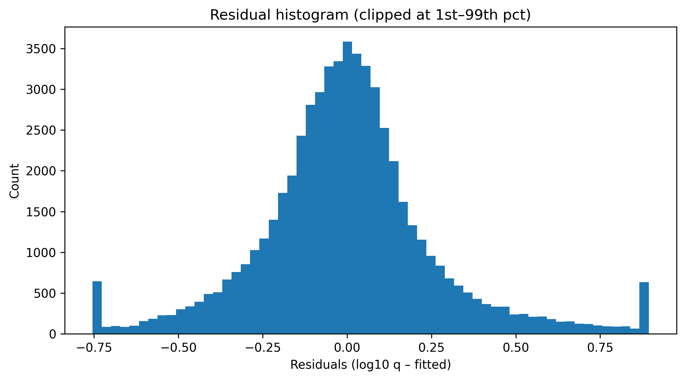

# Site-level Regression QA Report

**Model:** `log10(q) ~ log10(dist_min_km + 1)`

- **Global β_logdist:** -0.1129
- **95% CI:** [-0.1161, -0.1096]
- **R²:** 0.096
- **N (sites used):** 58,032

## Sensitivity by grid size (snap to metric grid)

|   snap_km |   beta_logdist |   ci_low |   ci_high |     R2 |          N |
|----------:|---------------:|---------:|----------:|-------:|-----------:|
|    0.5000 |        -0.1233 |  -0.1266 |   -0.1200 | 0.1041 | 61062.0000 |
|    1.0000 |        -0.1129 |  -0.1161 |   -0.1096 | 0.0960 | 58032.0000 |
|    2.0000 |        -0.0970 |  -0.1002 |   -0.0938 | 0.0797 | 54199.0000 |

## Residual map

## SR2 Panel

---

## Residual diagnostics

**Model (fixed):** `log10(q) ~ log10(dist_min_km + 1)`

- **N (used in fit):** 58,032
- **β_logdist (HC3):** -0.1129
- **R²:** 0.096

### Normality tests
- **Shapiro–Wilk** (≤5,000 subsample): W = 0.9112, p 3.184e-47 (log10 p = -46.5)
- **Jarque–Bera** (full): JB = 85484.79, p < 1e-300 (log10 p = -inf)

_Note: For large N, formal normality tests typically reject the null; robust HC3 inference does not rely on residual normality._

### Residual histogram
Clipped at the 1st–99th percentiles for visualization.

