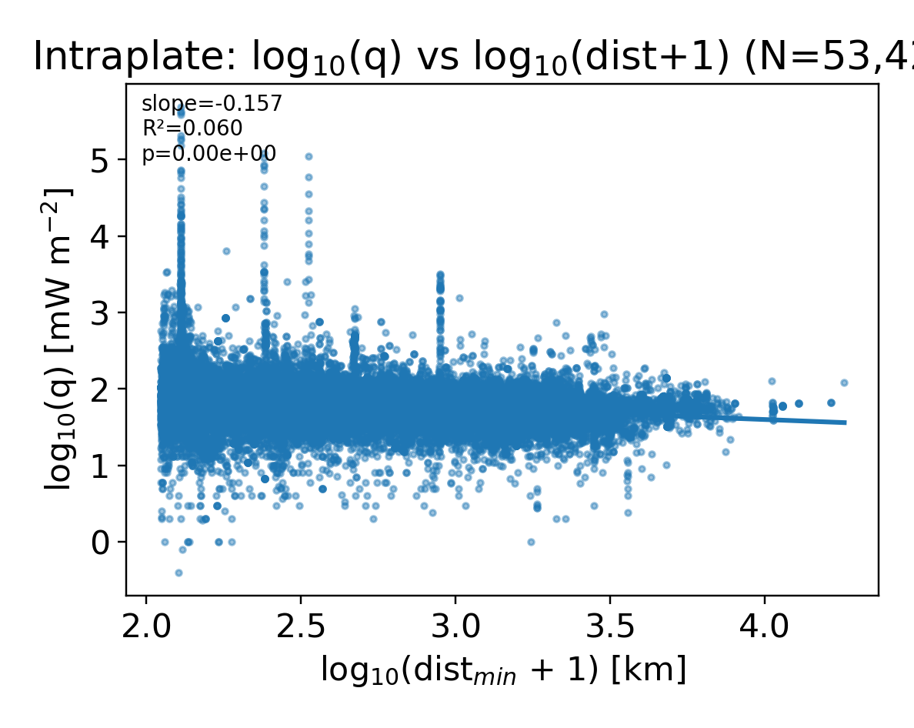

# Intraplate OLS (illustrative)

- Domain: dist_min_km ≥ 110 km
- Model: log10(q) ~ log10(dist_min_km + 1)
- N = 53,420

## OLS (HC3 robust SE)

- slope = -0.156844
- intercept = 2.226326
- R² = 0.059539
- p-value (slope) = 0.000e+00

## Figure

